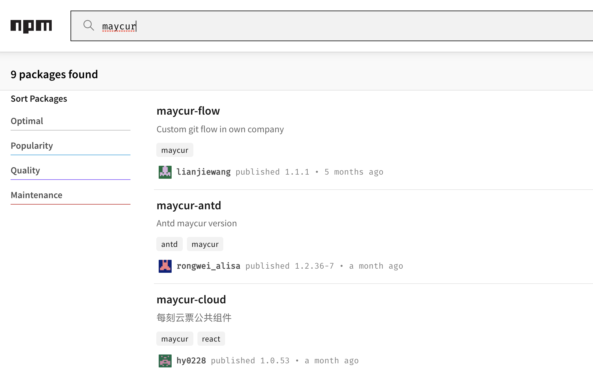
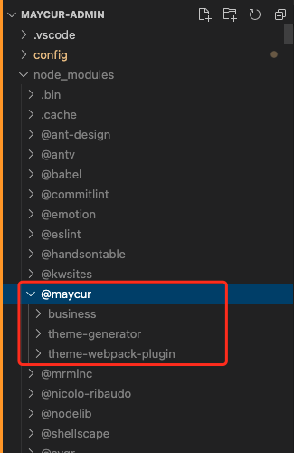

<!--
 * @Author: RongWei
 * @Date: 2021-09-20 11:21:19
 * @LastEditors: RongWei
 * @LastEditTime: 2021-10-14 10:40:37
 * @Description: file content
-->
# package.json 详解

## 什么是 npm
Node.js 标准的软件包管理器，可以管理项目依赖的下载

## 如何生成 package.json 和 package-lock.json
`npm init` 交互式问答的方式生成 package.json
`npm init -y` 自动生成默认的 package.json
`npm install` 安装 package.json 中的依赖，并生成 package-lock.json, 锁住依赖及依赖的依赖的版本
`npm install <pkg-name>` 安装某个软件包
`npm update <pkg-name>` 更新某个软件包
<!-- `npm root -g` 全局安装包的位置 -->

## [package.json](https://docs.npmjs.com/cli/v7/configuring-npm/package-json)
package.json 文件是项目的清单。它的内容没有固定的要求，满足 JSON 格式即可
- `name` 项目名称，有些包名会含有 [scope](https://docs.npmjs.com/cli/v7/using-npm/scope)
  - 不多于 214 个字符，包括 scope
  - 不能以 . 或 _ 开头
  - 不能包含大写字母
  - 有可能会成为 URL 的一部分、命令行参数或者文件夹名字，因此不能包含任何非 URL 安全字符，如空格、`(`、`\`、`"`；
  - 可能会作为 require() 的参数传递

- `version` 当前的版本
**当需要发布包时，以上两个属性是及其重要而且必须的，它们一起构成了一个唯一的标识符**
- `description` 描述信息
- `keywords` 与包功能相关的关键字数组
**以上两个属性在 npm 搜索的时候会被列出来，便于其他人发现你的模块**

- `homepage` 项目的主页地址
- `scripts` 指定了运行脚本命令的 npm 命令行缩写
  ```
  // 当根目录下有 server.js 时, start 命令默认是执行 server.js
  "scripts": {"start": "node server.js"}
  ```

- `dependencies` 项目运行所依赖的模块，`npm install <pck> --save-prod`
- `devDependencies` 项目开发所需要的模块，通常是一些开发、测试、打包工具，如 babel、webpack、ESLint、jest等， `npm install <pck> --save-dev` 或 `npm install <pck> -D`
***需要设置 --production 标志（npm install --production），以避免安装这些开发依赖项***
- `peerDependencies` 应用运行依赖的宿主包，可以被对等安装
- `bin` 指定各个内部命令对应的可执行文件的位置，在编写 node 工具的时候一定会用到。例如 webpack 模块：
  ```
  // 当我们执行 webpack 命令的时候，执行的是 bin/webpack.js 文件中的代码
  // 在模块以依赖的方式被安装，如果存在 bin 选项，会在 node_modules/.bin/ 下生成对应的文件，npm 会寻找这个文件，在 node_modules/.bin/ 目录下建立符号链接。由于 node_modules/.bin/ 目录会在运行时加入系统的 PATH 变量，因此在运行 npm 时，就可以不带路径，直接通过命令来调用这些脚本。
  // 可执行文件需要以 `#!/usr/bin/env node` 开头
  "bin": {
    "webpack": "bin/webpack.js"
  }
  ```
- `main` 指定加载模块的入口文件，require() 导入的时候就会加载这个文件。默认值是模块根目录下的 index.js
- `private` 设置为 true，npm 将拒绝发布它，为了防止私有模块被无意间发布出去
- `repository` 指定代码存放地址，对想要为你的项目贡献代码的人有帮助
  ```
  "repository": {
    "type": "git",
    "url": "https://github.com/xxx/xxx.git"
  }
  ```
- `bugs` 用于项目问题的反馈 issue 地址或者一个邮箱
  ```
  // 如果提供了 url，则可以被 npm bugs 命令使用
  "bugs": {
    "url": "",
    "email": ""
  } 
  ```
- `license` 软件包的许可证
- `author` 作者
  ```
  "author": {
    "name": "rongwei",
    "email": "rongwei@maycur.com",
    "url": "https://xxxx.com"
  }

  "author": "rongwei rongwei@maycur.com https://xxxx.com"
  ```
- `contributors` 贡献者
```
{
  "contributors": [
    {
      "name": "rongwei",
      "email": "rongwei@maycur.com",
      "url": "https://xxxx.com"
    }
  ]
}
```
### peerDependencies
>peerDependencies 的目的是提示宿主环境去安装满足插件 peerDependencies 所指定依赖的包，然后在插件 import 或者 require 所依赖的包的时候，永远都是引用宿主环境统一安装的 npm 包，最终解决插件与所依赖包不一致的问题。

#### 为何要引入 peerDependencies
假设：
```
// maycur-business 和 maycur-antd package.json
"dependencies": {
  "classnames": "^2.2.5"
}
```
那么我们在 form-web 中执行 `npm install` 会得到如下目录结构：
```
maycur-form-web
|- node_modules
   |- maycur-business
      |- classnames
   |- maycur-antd
      |- classnames
```
问题：
1、classnames 被多次安装
2、form-web 中无法直接使用 classnames，因为它没有被直接安装在 node_modules 目录下
为了解决这种问题，在 npm2 中引入了 peerDependencies
```
// maycur-business 和 maycur-antd package.json
"peerDependencies": {
  "classnames": "^2.2.5"
}
```
这时在 form-web 中执行 `npm install maycur-business` 会得到如下目录结构：
```
maycur-form-web
|- node_modules
   |- maycur-business
   |- maycur-antd
   |- classnames
```
在 npm3 - npm6 中，peerDependencies 不会被自动安装，当发现不符合要求的 peerDependencies 被安装时，会有警告信息。npm7 中，peerDependencies会默认被安装。


总结：
- 如果用户显式依赖了核心库，则可以忽略各插件的 peerDependency 声明；
- 如果用户没有显式依赖核心库，则按照插件 peerDependencies 中声明的版本将库安装到项目根目录中；
- 当用户依赖的版本、各插件依赖的版本之间不相互兼容，会报错让用户自行修复；

>95% of the time, you'll use only dependencies and devDependencies. But if you want to create and publish your own library so that it can be used as a dependency, you may also need the peerDependencies. Under this section, you can indicate which versions of some of your important libraries are required. Let's imagine that your project (ProjectA) uses an important library (peer-lib) and you know or at least guess that the project (MainProject) which will use your library will also use this peer-lib library. If you want to make sure that the version of peer-lib used in MainProject works with your version in ProjectA, you should use peerDependencies.

### [scope](https://docs.npmjs.com/cli/v7/using-npm/scope)
scope 是一种将相关的模块组织到一起的一种方式，可以防止包重名。
命名遵循 name 的规范，scope 前面是 @ 符号，后面是 /，格式为 `@somescope/somepackagename`，如：`@maycur/business`，会被安装在 `node_modules/@somescope/somepackagename`下
举个🌰


#### 包的访问级别
- public：
  - 可被任何人下载和使用
  - unscoped public package 存在于全局公共注册表中，可通过包名直接使用
  - scoped public package 是属于某个人或某个组织的，使用时必须加个人或组织的明细，如：`@username/package-name`，`@org-name/package-name`

#### scopes 和 包的可见性
- 包的可见性由包的 scope 和访问级别（公共或私有）来决定。
- 非 scope 的包总是公共的
- 私有包总是有作用域(scope)的
- 带有 scope 的包默认是私有的，当想发布一个公共模块时，必须要带有参数 `--access public`

#### 使用带有 scope 的模块
`const XX = require('@naycur/business')` 或者 
`import XX from '@maycur/business'`
会加载 node_modules/@maycur/business 模块

#### 发布带有 scope 的模块
`npm publish` 默认发布为私有模块，省略了 `--access restricted`。发布作用域包要求必须有一个 npm 私有模块账户，可以选择自己搭建一个 npm 服务或者直接使用官方提供的服务，发布 user-scoped 或者 organization-scoped 的包
`npm publish --access public` 发布为共有模块

私有的 npm 包总是带有 scope，带有 scope 的包默认是私有的。

#### 将一个 scope 和一个注册表关联
`npm login --registry=https://npmjs-dev.maycur.com/ --scope=@maycur`
`npm config set @maycur:registry https://npmjs-dev.maycur.com/`
scope 和注册表是多对一的关系：一个注册表可以承载多个作用域，但一个作用域只能指向一个注册表。scope 和 registry 关联之后，所有带有该 scope 的包都会从与之关联的 registry 下载

### version 
语义版本控制（semver）
`x.y.z` 主版本.次版本.补丁版本
- 进行不兼容的 API 更改时，升级主版本
- 以向后兼容的方式添加功能时，升级次版本
- 进行向后兼容的方式修复缺陷时，升级补丁版本

>当主版本号升级后，次版本号和修订号需要重置为0，次版本号进行升级后，补丁版本需要重置为0。  

先行版本号（预发布号）：发布正式版之前的版本，格式是在补丁版本后加一个连接号，再加上一连串以点分割的标识符
```
1.0.0-alpha
1.0.0-alpha.1
1.0.0-0.3.7
```

更新版本时的规则：
- `^` 只会执行不更改最左边非零数字的更新，如 ^1.2.2 表示安装 1.x.x 的最新版本（不低于 1.2.2）; ^0.2.3 表示安装 0.2.x 的最新版本。使用 `npm install <pkg-name>`时，默认会加 ^ 
- `~` 更新到补丁版本，如 ～1.2.2 表示安装 1.2.x 的最新版本（不低于 1.2.2）
- `>`
- `>=`
- `<`
- `<=`
- `=`
- `-` 接受一定范围的版本，`2.1.0 - 2.6.2`
- `||` 组合集合 `< 2.1 || > 2.6`
- `tag` 
- `x`、`X`、`*` 通配符

### [npm version](https://docs.npmjs.com/cli/v7/commands/npm-version)
`npm version [<newversion> | major | minor | patch | premajor | preminor | prepatch | prerelease`
- 运行该命令会更改版本号，并将数据写入 package.json 和 package-lock.json
- 当在 git repo 中运行该命令时，会自动进行 git commit 操作并打标签 tag，可通过 `npm --no-git-tag-version version` 来禁止打标签。
- 运行该命令需要确保工作目录是干净的，可通过 `-f` 或者 `--force` 来跳过此操作

|npm version|功能|
|---|:--|
|major|- 如果没有预发布号，则直接升级一位大号，其他位都置为0；<br/>- 如果有预发布号：<br/>-- 中号和小号都为0，则不升级大号，而将预发布号删掉，即2.0.0-1变成2.0.0，这就是预发布的作用；<br/>-- 如果中号和小号有任意一个不是0，则会升级一位大号，其他位都置为0，清空预发布号。即 2.0.1-0变成3.0.0|
|minor|- 如果没有预发布号，则升级一位中号，大号不动，小号置为空<br/>- 如果有预发布号:<br/>-- 如果小号为0，则不升级中号，将预发布号去掉<br/>-- 如果小号不为0，升级中号，小号置空，同理没有预发布号|
|patch|- 如果没有预发布号：直接升级小号<br/>- 如果有预发布号：去掉预发布号，其他不动|
|premajor|- 直接升级大号，中号和小号置为0，增加预发布号为0|
|preminor|- 直接升级中号，小号置为0，增加预发布号为0|
|prepatch|- 直接升级小号，增加预发布号为0|
|prerelease|- 如果没有预发布号：增加小号，增加预发布号为0<br/>- 如果有预发布号，则升级预发布号|

### [scripts](https://docs.npmjs.com/cli/v7/using-npm/scripts)
`scripts` 属性支持大量内置的脚本及其预置的声明周期事件，可通过 `npm run-script <task-name>`（简写为 `npm run <task-name>`） 来执行。
匹配到 task-name 的 pre 和 post 命令也会执行
```
"scripts":{
  "prebuild": "{{ executes BEFORE the `build` script }}",
  "build": "{{ run command to build files }}",
  "postbuild": "{{ executes AFTER `build` script }}"
}
```

### 发布包
[npm publish](https://docs.npmjs.com/cli/v7/commands/npm-publish) 
`npm publish [<tarball>|<folder>] [--tag <tag>]`

- Publishes '.' if no argument supplied
- Sets tag 'latest' if no --tag specified` 
- `<tarball>|<folder>` 中一定包含 package.json
## [package-lock.json](https://docs.npmjs.com/cli/v7/configuring-npm/package-lock-json)
package-lock.json 会固化当前安装的每个软件包的版本
当运行 `npm update` 时，`package-lock.json` 中的软件包的版本会被更新
requires 字段指定了软件包的依赖，它们会按照字母顺序被添加到文件中，每个都有 `version` 字段，指向软件包位置的 `resolved` 字段，以及用于校验软件包的 `integrity` 字段

不同 npm 版本下 `npm install` 的规则
- `npm 5.0.x` 不管 package.json 中依赖是否更新， 都会根据 package-lock.json 下载
- `npm 5.1.0`后，当 package.json 中的依赖项有新版本时，`npm install` 会无视 package-lock.json 去下载新版本的依赖并更新 package-lock.json
- `5.4.2`版本后，
  - 如果只有一个 package.json 文件，运行 `npm i` 会根据它生成一个 package-lock.json 文件
  - 如果 package.json 的 `semver-range version` 和 package-lock.json 中版本兼容，即使 package.json 中有新的版本，也还是会根据 package-lock.json 下载
  - 如果手动修改了 package.json 的 version ranges，且和 package-lock.json 中版本不兼容，那么执行 `npm i` 时 package-lock.json 将会更新到兼容 package.json 的版本

### 查看 npm 包安装的版本
`npm list` 也可以打开 package-lock.json 文件查看
`npm list -g` 适用于全局安装的软件包
`npm list --depth=0` 仅获取顶层的软件包，package.json 中列出的软件包
`npm list <pkg-name>` 获取特定软件包的版本，也适用于安装的软件包的依赖
`npm view <pkg-name> version` 查看软件包在 npm 仓库上的最新可用版本
`npm view <pkg-name> versions` 查看软件包在 npm 仓库上的所有版本
`npm outdated` 发觉软件包的新版本

问题：
- peerDependencies
- 写一个 cli 工具，代替 business 的 publish 命令
- npm install --production

参考文献
- [npm Docs](https://docs.npmjs.com/)
- [npm的package.json和package-lock.json更新策略](https://blog.csdn.net/weixin_43820866/article/details/105232066)
- [](https://indepth.dev/posts/1187/npm-peer-dependencies)
- [](https://code-trotter.com/web/dependencies-vs-devdependencies-vs-peerdependencies/)

